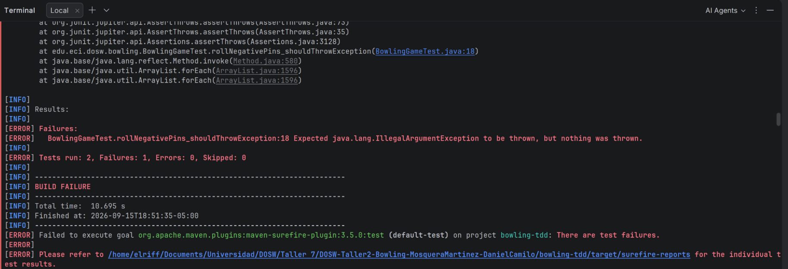
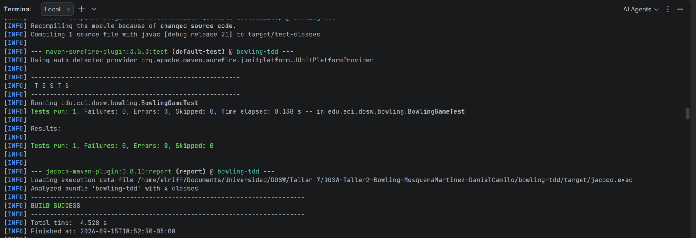
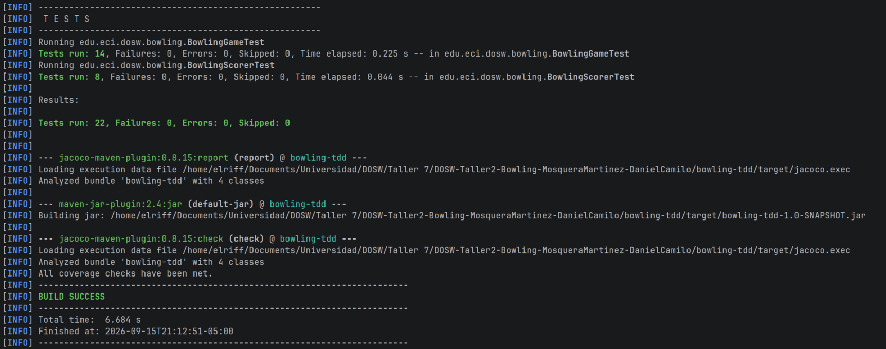
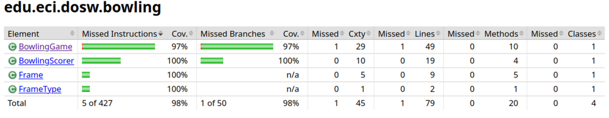
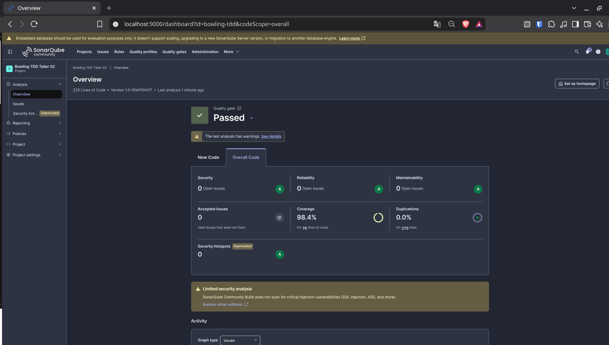

# Taller 1 - Motor de Puntuación de Bowling con TDD

## 1. Identificación
* **Nombre completo:** Daniel Camilo Mosquera Martinez
* **Código estudiantil:** 1000099251
* **Correo institucional:** Daniel.mmartinez@mail.escuelaing.edu.co

---

## 2. Descripción del Proyecto
El proyecto digitaliza el sistema de puntuación para **BowlTech S.A.S.**, automatizando el registro de tiros y el cálculo
de bonos de *Spare*, *Strike* y las reglas especiales del *Frame 10*.

### Responsabilidades de las clases
* **`BowlingGame`:** Motor principal del juego. Administra el estado de los 10 frames, valida la entrada de pinos y 
controla el flujo de tiros.
* **`Frame`:** Entidad que almacena los tiros individuales y clasifica el tipo de tiro realizado en ese turno.
* **`FrameType`:** Enumeración con los tipos posibles de frame (`NORMAL`, `SPARE`, `STRIKE`, `TENTH`).
* **`BowlingScorer`:** Servicio sin estado encargado del cálculo matemático del puntaje acumulado y la suma de bonos.

---

## 3. Evidencia del Ciclo TDD
Se aplicó la metodología **RED → GREEN → REFACTOR** para cada uno de los casos requeridos.

### Ciclo de Ejemplo: Caso A2 (`roll(-1)`)
1. **RED:** Se escribió la prueba `rollNegativePins_shouldThrowException` esperando `IllegalArgumentException`. La prueba
falló porque `roll()` aún no tenía validación.
   

2. **GREEN:** Se incluyó el bloque `if (pins < 0)` en `BowlingGame.java` para que la prueba pasara en verde exitosamente.
   

3. **REFACTOR:** Se extrajo la comprobación a un método auxiliar `validatePins(pins)` para eliminar código repetido sin
romper las pruebas pasadas.

---

## 4. Cobertura de Código con JaCoCo
El umbral mínimo exigido por la configuración de Maven es del 85% en cobertura de líneas.
* **mvn test y verify (Build Success)**
  

* **Reporte Final (Cobertura >= 85%):**
  

*Explicación:* Las pruebas agregadas para los casos de borde en el Frame 10 (`A8`, `C4`, `C5`) y la validación de juegos
incompletos (`B8`) fueron las que permitieron subir la cobertura por encima del umbral requerido.

---

## 5. Análisis Estático con SonarQube
Se ejecutó el análisis estático usando el contenedor de SonarQube desplegado localmente.

* **Estado del Quality Gate:** PASSED / PASADO
* **Issues encontrados y corregidos:** Se eliminaron variables sin usar y se declararon constantes explícitas para las 
excepciones de rango.

---

## 6. Pull Requests
Los cambios se integraron mediante Pull Requests sin realizar commits directos a las ramas principales[cite: 1].

| Enlace al PR                                                                                                               | Fecha de Merge | Módulo que cubre                           |
|:---------------------------------------------------------------------------------------------------------------------------|:---------------|:-------------------------------------------|
| [PR #1: Feature Bowling TDD](https://github.com/Danielmmartinez/DOSW-Taller2-Bowling-MosqueraMartinez-DanielCamilo/pull/1) | 15/09/26       | Módulos A, B y C (Game, Scorer, isComplete)|

---

## 7. Reflexión Técnica

### 01. ¿Qué caso edge del Bowling fue el más difícil de implementar con TDD y por qué?
El caso más complejo fue el **Frame 10** (Casos A8, C4, C5). A diferencia de los primeros 9 frames que aceptan 1 o 2 tiros,
el décimo frame debe condicionar si otorga un 3er tiro dependiendo de si se logró un Strike o un Spare, lo cual requirió
ajustar las validaciones de `isComplete()` sin romper los frames estándar anteriores.

### 02. ¿Qué parte del código cambió durante REFACTOR sin modificar el comportamiento observable?
En `BowlingGame.java`, el método `roll()` fue refactorizado para delegar la lógica interna a dos métodos privados 
`handleStandardFrame` y `handleTenthFrame`. Toda la estructura de múltiples `if-else` anidados se simplificó sin alterar
el resultado esperado de las pruebas unitarias.

### 03. ¿Qué casos de prueba descubriste al revisar el reporte de cobertura de JaCoCo que no habías considerado antes?
Al revisar las líneas amarillas en JaCoCo, descubrimos que faltaba validar el escenario de lanzar el tiro de bono del 
frame 10 superando los 10 pinos en combinaciones de tiros parciales, así como intentar llamar a `score()` antes de haber
finalizado el juego (Caso B8).

### 04. ¿Qué hallazgo de SonarQube produjo un cambio real en el código?
SonarQube señaló un code smell relativo a la duplicación de cadenas literales para los mensajes de las excepciones 
`IllegalArgumentException`. Esto derivó en la refactorización para centralizar la validación de rango dentro del método 
`validatePins`.